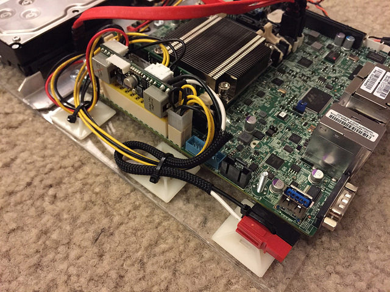

# Blade/board thingy

Each motherboard blade is a 9.5" x 13.5" sheet of 1/8" thick acrylic.

A piece of 1/2" aluminium angle stock (9.5" long) is bolted across the blade
for reinforcement.  I've found the board will sag over time without this,
especially when using dual hard drives, and can rub the heatsinks of the
board underneath it.

On the left side I use three 1" cable tie mounting pads to keep the power
wiring in place and fix the Powerpole connector to the edge of the blade
for easy access.

On the right side I have mounted a momentary rocker switch for power/reset.
One mounting pad fixes the switch to the front where it's accessible, and
another helps hold the wire in place.

For mounting the motherboard to the blade, I run machine screws (size #8
I think?) through the bottom of the blade, and thread on a couple of nuts
to make a crude standoff. The motherboard goes over the four screws and
a final nut holds it down.

Likewise for each hard drive I run a machine screw (#8 x 1/2"?) through
the blade, thread on a couple of nuts, and then run the screw into the
bottom of the hard drive. I stand the hard drive about a quarter inch off
the blade.

For 2.5" drives, I think they need #6 screws.

The blades can handle either 2x 3.5" hard drives, 2x 2.5" hard drive/SSDs,
or 3x 2.5" HDD/SSDs. For the three drive configuration, they're in a "V"
configuration. I figure this is better for heat/airflow and makes it easier
to get at the nuts underneath the drives.

