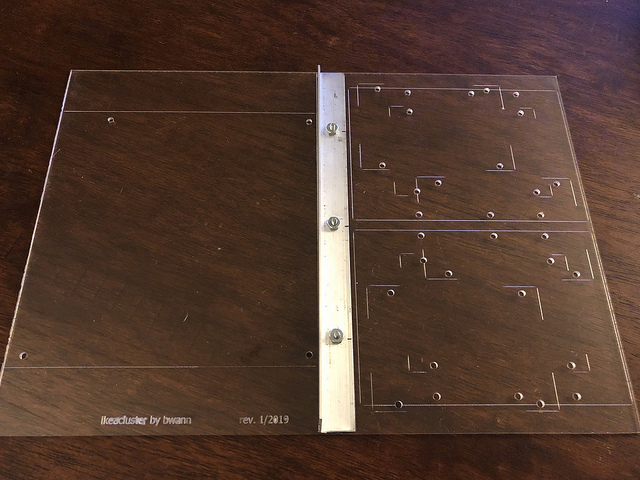
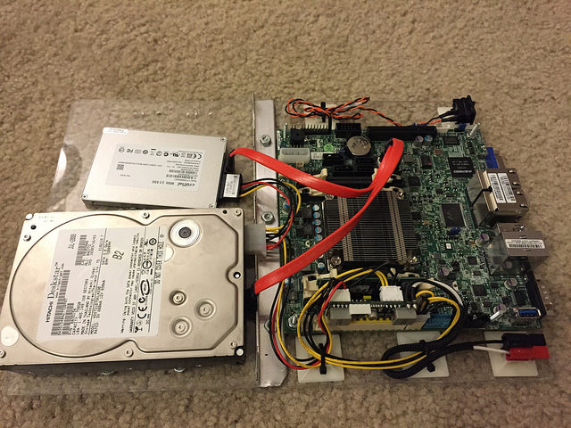
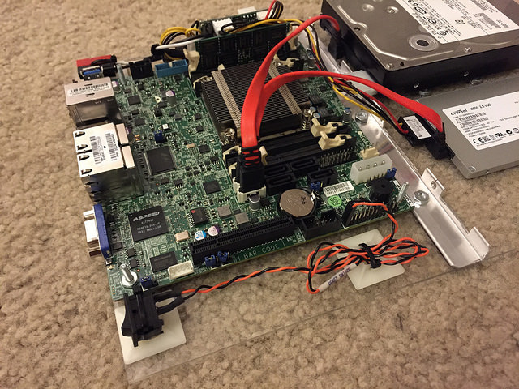
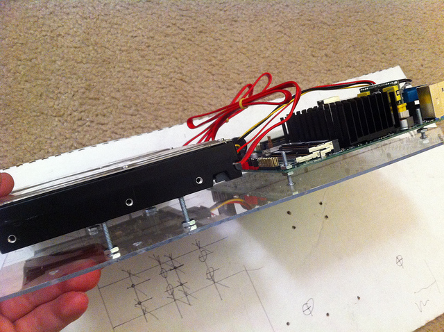

# Motherboard blade/board thingy

Each motherboard in the cabinet mounts to a 9.5" x 13.5" sheet of 1/8" thick
acrylic.

This is the maximum dimension I can use in my design to still be able to
use front and rear doors, and clear the fans on the rear door.  I use a strip
of aluminum to prevent sagging over time due to heat.

### Materials

For each motherboard in your cabinet:

* 9.5" x 13.5" x 1/8" (or .100") acrylic sheet
* #8 x 1/2" machine screws + nuts (motherboard and drives)
* 9.5" x 1/2" aluminum angle stock
* #8 x 1/2" machine screws + nuts (reinforcement bar)
* 5x 1" cable tie mounting pads
* Momentary rocker switch (power/reset button)
* Tiny zip ties
* PicoPSU
* Powerpole connectors
* SATA power splitter, 2/3-way (optional)
* Short SATA cables

Acyrlic usually comes in sheets of 11" x 14" or larger, so you'll need to
cut it down. (This is where having access to a laser cutter helps!)

The HELMER kit contains six sheets of thin sheet metal for the drawers,
you could cut them down and use them if you wanted to reuse some of the
material.  I've opted to use the same acrylic sheets for all 10 blades.

### Motherboard power

The PicoPSU is what makes this whole project possible.  It's basically a
tiny DC-DC power supply that plugs directly into the 20/24-pin ATX power
socket on a motherboard. It takes 12 VDC in, powers the motherboard, and
has Molex+SATA connectors for a hard drive. They come in a variety of sizes,
from 90 watt to 150 watt.

Depending on the hard drives you use, you could use the Molex connector on
one drive, SATA power on another, or use a "Y" splitter for 1-3 SATA drives.

Usually the PicoPSU comes with a 3.5mm barrel connector for power input.
Because I dabble in amateur radio, I standardized a long time ago on the
Anderson Powerpole for all of my 12 volt connectors.  Here I chop off the
barrel connector and solder on Powerpole ends.  Use a couple of inches of
1/4" wire loom to help keep the power pigtail neat.

After the motherboard is mounted, I'll connect the PicoPSU, then ziptie
all the loose wires to the blade so they won't snag on anything.

### SATA connections

I use a couple of 6" SATA cables, preferably with a 90-degree L-ends (but
not required), between the motherboard and drive(s).  Longer is fine, it's
just more to keep tied up to stay neat.

### Mounting to the blade

A piece of 1/2" aluminium angle stock (9.5" long) is bolted across the blade
for reinforcement.  I've found the board will sag over time without this,
especially when using dual hard drives, and can rub the heatsinks of the
board underneath it.

There's no need to notch the angle stock like I have in some of the photos.
It seemed like a good idea, but didn't really help anything.  Instead I
mount the upright side against the motherboard so it doesn't get in the way
of cables to the drives.

On the left side of the blade I use three 1" cable tie mounting pads to keep
the power wiring in place and zip-tie the Powerpole connector to the edge of the
blade for easy access. This is very handy as it makes the connector easier
to connect/disconnect and keeps excess wire under control.

On the right side I have mounted a momentary rocker switch for power/reset.
One mounting pad fixes the switch to the front where it's accessible, and
another helps hold the wire in place.

For mounting the motherboard to the blade, I run machine screws (size #8
I think?) through the bottom of the blade, and thread on a couple of nuts
to make a crude standoff. The motherboard goes over the four screws and
a final nut holds it down.

Likewise for each hard drive I run a machine screw (#8 x 1/2"?) through
the blade, thread on a couple of nuts, and then run the screw into the
bottom of the hard drive. I stand the hard drive about a quarter inch off
the blade so air can circulate around it.

For 2.5" drives, I think they need #6 screws.

The blades can handle either 2x 3.5" hard drives, 2x 2.5" hard drive/SSDs,
or 3x 2.5" HDD/SSDs. For the three drive configuration, they're in a "V"
configuration. I figure this is better for heat/airflow and makes it easier
to get at the nuts underneath the drives.

